# 3.2.1 Insert in binary search tree

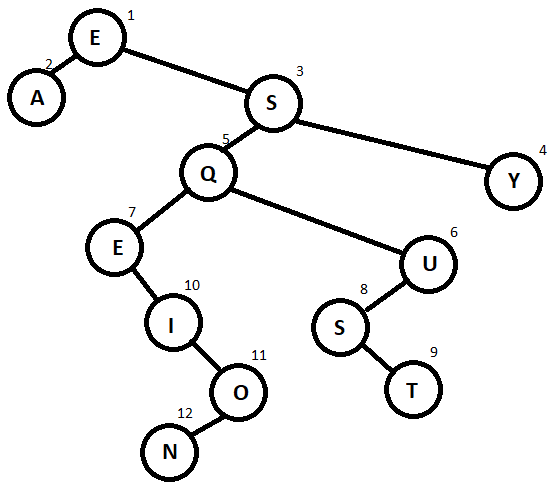

Requires a total of 28 compares tpo build the tree.

Number of compares per letter inserted in the tree:
- E: 0 compares
- A: 1 compares
- S: 1 compares
- Y: 2 compares
- Q: 2 compares
- U: 3 compares
- E: 1 compares
- S: 2 compares
- T: 4 compares
- I: 3 compares
- O: 4 compares
- N: 5 compares

# 3.2.18 Delete in binary search tree

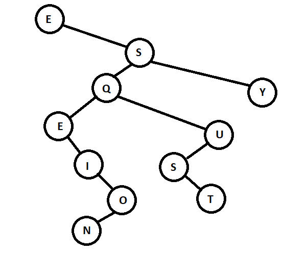
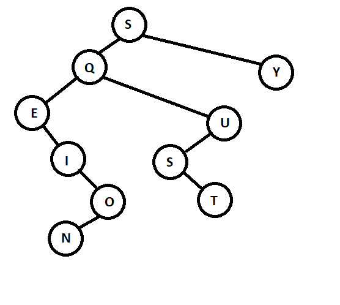
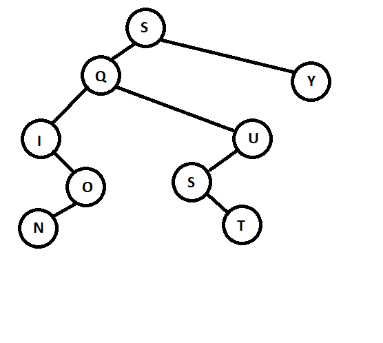
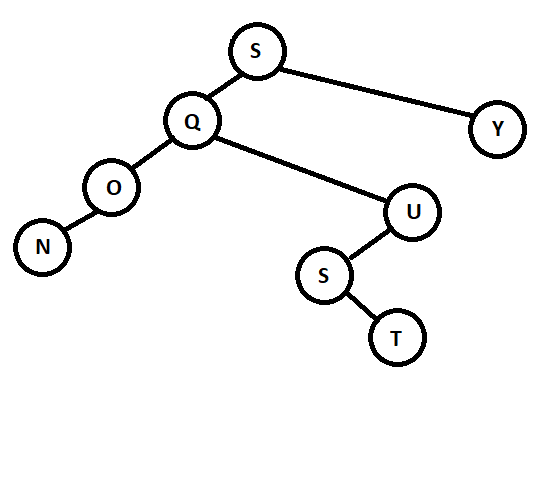
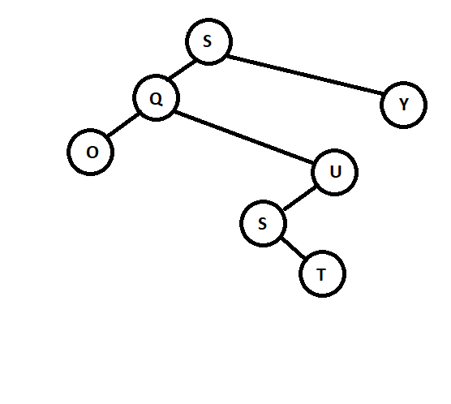
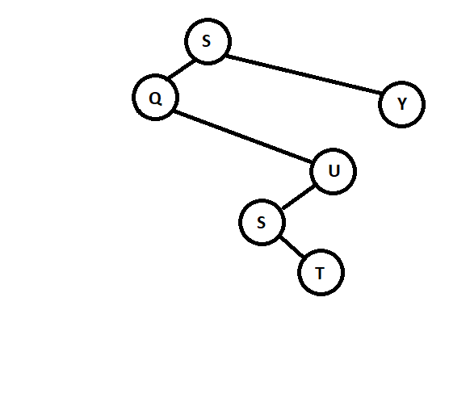
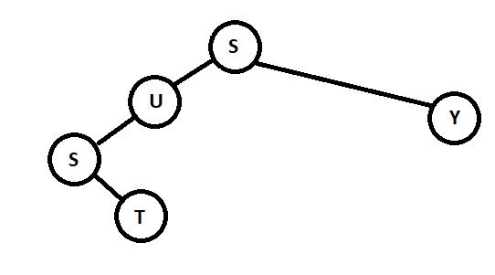
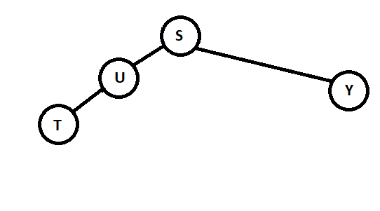
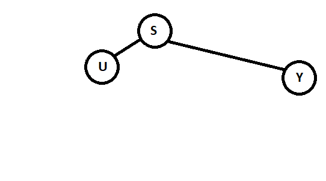
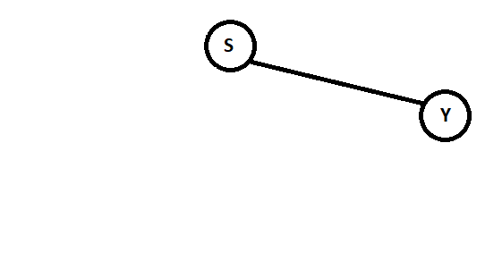
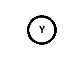

# 3.3.1 Insert in 2-3 tree

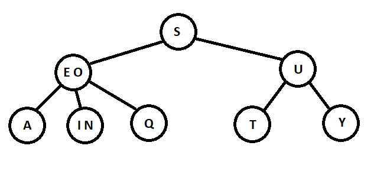

# 3.3.10 Insert in red-black binary search tree

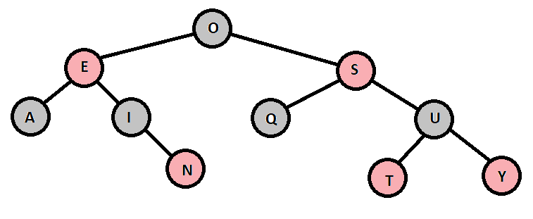

# Small algorithm project

Use statistics to try to find the 3 keys. Count the numbers of the diffrent letters and assume:
1. e is the most common letter
2. e is the second most common letter
3. e is the thrid most common letter
4. t is the most common letter
